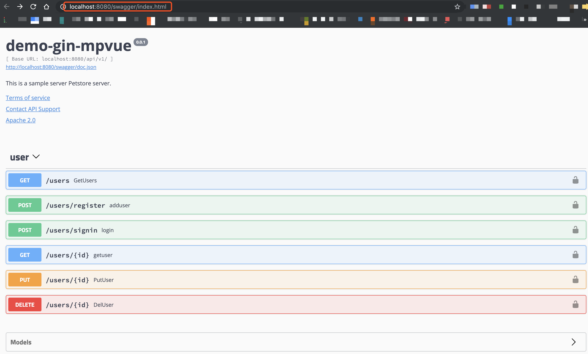

## 服务端

服务端 


### gin-swagger中间件

---

>[gin-swagger](https://github.com/swaggo/gin-swagger)
>
>[swaggo文档](https://swaggo.github.io/swaggo.io/declarative_comments_format/general_api_info.html)

#### 1、获取Swag
```shell script
$ go get -u github.com/swaggo/swag/cmd/swag
```
#### 2、在包含main.go文件的go项目根目录下运行Swag命令（swag将会解析命令，并生成相应的的文件：docs folder and docs/doc.go）.
```shell script
$ swag init
```
#### 3、下载gin-swagger
 ```shell script
$ go get -u github.com/swaggo/ç
$ go get -u github.com/swaggo/files
```
#### 4、文档编写
a) 编写全局信息注释，在主函数上编写
> 格式：// ***@param info***
```go
// @title demo-gin-mpvue
// @version 0.0.1
// @description This is a sample server Petstore server.
// @termsOfService http://swagger.io/terms/

// @contact.name API Support
// @contact.url
// @contact.email chenganggo@gmail.com

// @license.name Apache 2.0
// @license.url http://www.apache.org/licenses/LICENSE-2.0.html

// @host chenganggo@gmail.com
// @BasePath /v1
func main() {
	r:=routers.InitRouter() //初始化路由

	// use ginSwagger middleware to
	url := ginSwagger.URL("http://localhost:8080/swagger/doc.json") // The url pointing to API definition
	r.GET("/swagger/*any", ginSwagger.WrapHandler(swaggerFiles.Handler, url))

	r.Run(":8080")
}
```
其他注释对照着参考文档即可。

b) 编写应用注释，即在响应函数的上方编写注释
> [应用注释文档](https://swaggo.github.io/swaggo.io/declarative_comments_format/api_operation.html)
```go
// @log in
// @Summary Print
// @Accept json
// @Tags Name
// @Security Bearer
// @Produce  json
// @Param name path string true "name"
// @Resource Name
// @Router /users/signin [post]
// @Success 200 {object} models.User
func SignIn(c *gin.Context) {}
```
#### 5、项目目录下 执行命令
```shell script
$ swag init
```
自动生成 docs 文件夹，内含 swagger.json 、swagger.json 、 docs.go

编译不通过，查看报错信息，修改注释。
#### 6、导入生成的 docs 文件
在相应的路由层中相应的引入docs文件依赖
```go
import (
	"github.com/gin-gonic/gin"
	controller
	_ "src/docs" /* 引入相应的doc文件， docs is generated by Swag CLI, you have to import it.doc files */ 
)


func InitRouter() *gin.Engine{}
```
#### 7、成功截图
 